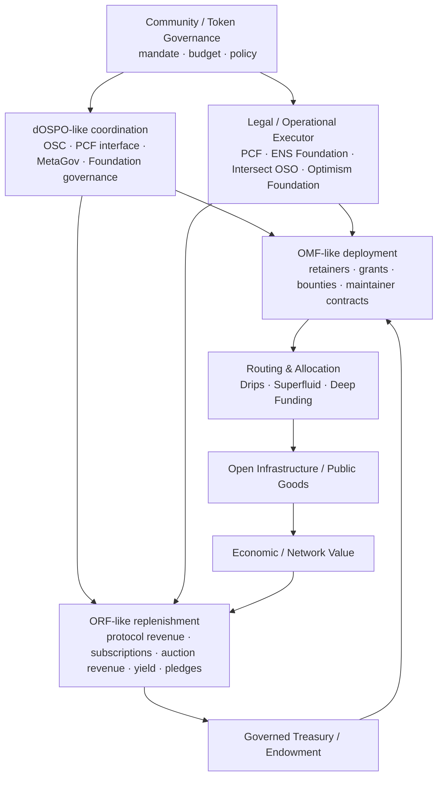
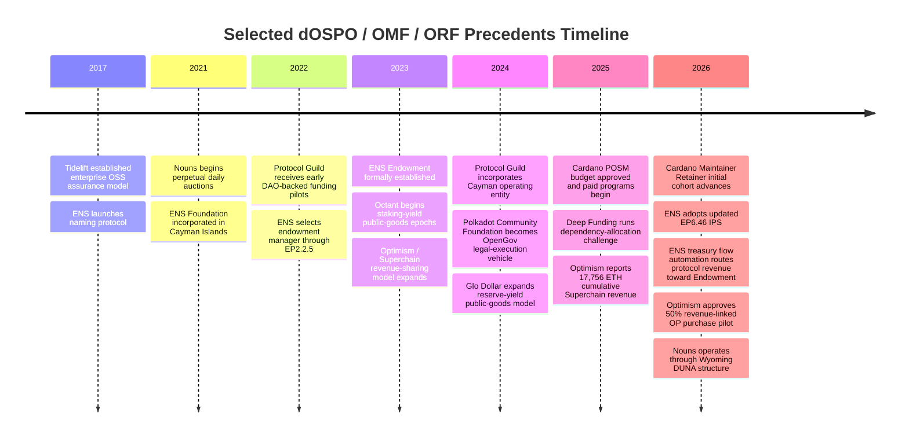

# Prior Art & Competitive Analysis

> **Comprehensive Evaluation of Web3 & Web2 Public-Goods Sustainability Ecosystems**  
> *LF Decentralized Trust · Open Source Frontiers Lab · Release Edition: `v0.8.0-rc.1`*

---

## 1. Executive Summary & Synthesis

Funding open-source software infrastructure has historically suffered from structural institutional breakdowns: traditional grant-making creates episodic single-shot funding, charity relies on volunteer altruism, and single-vendor sponsorship creates corporate capture risks.

The **Open Source Frontiers Lab (OSF)** synthesizes operational lessons from Web2 and Web3 precedents into a unified 3-piece architecture: **dOSPO (Governance Coordination)**, **OMF (Maintenance Deployment)**, and **ORF (Replenishment)**.

### Master Synthesis Finding
Primary evidence demonstrates that while virtually every component of the OSF architecture exists in production across Web3 (Polkadot PCF, ENS Endowment, Optimism Superchain, Cardano POSM, Protocol Guild, Tidelift), **no reviewed ecosystem implements the complete dOSPO $\rightarrow$ OMF $\rightarrow$ ORF loop under those names with clean functional separation**. OSF's core contribution is integrating these proven mechanisms into one auditable, closed-loop sustainability system.



---

## 2. Chronological Evolution of Sustainability Precedents (2017–2026)



---

## 3. Order-of-Magnitude Financial & Capital Scale Comparison

```text
    SELECTED OBSERVED ANNUAL FINANCIAL FLOWS (USD MILLIONS)
    ┌────────────────────────────────────────────────────────────┐
    │ Polkadot 2025 Treasury Spend       ■■■■■■■■■■■■■■ $70.6M   │
    │ ENS DAO 2025 Operating Revenue     ■■■ $18.22M             │
    │ Protocol Guild 2025 Funds Raised   ■ $7.2M                 │
    │ Octant Epoch 8 Distribution        ■ $1.7M                 │
    │ Cardano 2025 Bug Bounty Pool       ■ $0.3M                 │
    │ Deep Funding 2025 Challenge Pool   ■ $0.22M                │
    └────────────────────────────────────────────────────────────┘

    CAPITAL ENDOWMENT & RESERVE BASES
    ┌────────────────────────────────────────────────────────────┐
    │ ENS DAO Endowment AUM (April 2026) ■■■■■■■■■■■■ $93.39M    │
    │ Octant v1 Staked Capital           ■■■■■■■■■■■ 100,000 ETH  │
    │ Optimism Treasury (Oct 2025)       ■■ 21,500 ETH           │
    └────────────────────────────────────────────────────────────┘
```

---

## 4. Deep Ecosystem Precedent Case Studies

### 4.1 Polkadot Community Foundation (PCF) & OpenGov
- **OSF Mapping**: **dOSPO Legal Execution Layer & Safeguard 2 (Operator Replaceability)**.
- **Detailed Mechanics**: PCF is a **Cayman Islands Foundation Company** explicitly structured as an "unopinionated" off-chain executor of OpenGov referenda. It signs commercial vendor contracts, makes fiat payroll transfers, holds IP licenses, and manages legal compliance, while DOT holders retain 100% governance authority.
- **Empirical Metrics**: 2025 Polkadot Treasury spend reached ~$70.6M (~$21.6M for development). Referendum #1122 authorized $1.5M USDC for the Anemoy Liquid Treasury Fund.
- **Key Takeaway**: Proves that a decentralized ecosystem can separate policy authorization (OpenGov) from legal execution (PCF wrapper) without giving discretionary custody to operators.

### 4.2 ENS DAO & Endowment Architecture (EP6.46 IPS)
- **OSF Mapping**: **Closest Full Closed-Loop Precedent (ORF Protocol Revenue + Governed Endowment IPS)**.
- **Detailed Mechanics**: Canonical domain registration/renewal fees flow automatically via Registrar Manager contracts (EP6.39) into a non-custodial endowment managed by KPK under a formal Investment Policy Statement (EP6.46).
- **Empirical Metrics**: April 2026 Endowment AUM reached **$93.394M** (~99% deployed; 62.8% ETH, 37.2% stablecoins), generating **$209K April strategy returns** and over **$8M in cumulative net DeFi returns** since inception. Endowment returns covered **20.3%** of 2025 operating expenses ($17.54M).
- **Key Takeaway**: Demonstrates that capital yield acts as a **resilience layer**, covering a fraction of operating budgets, rather than a magic perpetual money machine.

### 4.3 Optimism Superchain Revenue & RetroFunding
- **OSF Mapping**: **ORF Layer 1 (Protocol Fee Routing — $\tau$ Split) & OMF Distribution**.
- **Detailed Mechanics**: Member OP Stack chains contribute the greater of **15% of net profit or 2.5% of gross fees** to the shared Collective Treasury. Bi-cameral governance (Token House & Citizens' House) distributes capital via Retro Funding/Missions using Open Source Observer (OSO) impact metrics.
- **Empirical Metrics**: Cumulative Superchain revenue reached **17,756 ETH** by June 2025. Retro Funding committed **26.4M OP to 437 grantees**. Jan 2026 vote authorized 50% revenue-linked OP buybacks (first execution used 95.8 ETH to purchase 1.57M OP).
- **Key Takeaway**: Proves protocol fee splits generate massive non-inflationary replenishment, but Base's 2026 stack move highlights **payer concentration and exit risk**.

### 4.4 Cardano Paid Open Source Model (POSM)
- **OSF Mapping**: **OMF Maintenance Deployment & dOSPO Precursor**.
- **Detailed Mechanics**: Managed by Intersect MBO's Open Source Committee (OSC policy) and Open Source Office (OSO execution). Programs include Maintainer Retainers, Tooling Sustainability, Code for Us, and Bug Bounties.
- **Empirical Metrics**: 2025 POSM budget request approved at **5.885M ADA**. First-year Bug Bounty pool of **$300K** was 100% utilized by July 23, 2026. Maintainer Retainers launched a 6-maintainer pre-pilot in April 2026.
- **Key Takeaway**: Strongest Web3 laboratory for OMF maintenance programming, but relies on treasury allocations rather than earned ORF revenue.

### 4.5 Protocol Guild
- **OSF Mapping**: **OMF Program 1 (Maintainer Retainers) & ORF Voluntary Pledges**.
- **Detailed Mechanics**: On-chain split contract vesting voluntary 1% project token/yield pledges over 4 years for ~180 core Ethereum L1 developers. Formed a Cayman Islands entity in 2024, allocating 10% of vested funds for legal, tax, and operating reserves ($200K 2-year ops reserve).
- **Empirical Metrics**: Raised **$7.2M from 6,202 unique donors** in 2025; stewards **187 members** across 10+ client teams in 2026.
- **Key Takeaway**: Proves custody-free, tenure-weighted maintainer retainers scale, but demonstrates that even voluntary donation split contracts require legal/operating reserves.

### 4.6 Tidelift Enterprise
- **OSF Mapping**: **ORF Layer 3 (Enterprise Earned Revenue — Assurance Subscriptions)**.
- **Detailed Mechanics**: Tidelift contracts directly with open-source package maintainers across JavaScript, Python, Java, and Go, paying stipends in exchange for security triage, license audits, and maintenance assurances under commercial enterprise subscriptions.
- **Empirical Metrics**: Named commercial customers include **Cisco, Fannie Mae, and the U.S. Air Force**. Acquired by SonarQube.
- **Key Takeaway**: Strongest commercial proof that enterprises will pay for open-source supply-chain assurance when backed by maintainer commitments.

### 4.7 Nouns DAO, Glo Dollar, Octant, Deep Funding & Juicebox Revnets
- **Nouns DAO**: Daily perpetual auction (100% proceeds to treasury) operating under a Wyoming DUNA structure. Proves scarce native assets recapitalize treasuries, but depends on unique cultural demand.
- **Glo Dollar**: Reserve yield from fiat-backed stablecoins donated 100% to public goods (>$2,000/mo donated). Demonstrates yield redirection.
- **Octant (Golem Foundation)**: 100,000 ETH staked capital routing validator yield to public-goods matching pools (~460 ETH / $1.7M distributed in Epoch 8). Proves yield routing for capitalized entities.
- **Deep Funding**: Dependency graph allocation challenge ($220K 2025 challenge pool across 34 seed repos, 5,000 dependencies, 15,000 weights). Allocation engine, NOT revenue source.
- **Juicebox Revnets**: Contract-owned revenue networks with preconfigured split rules and tokenized capital formation. Frontier research path for autonomous rails.
