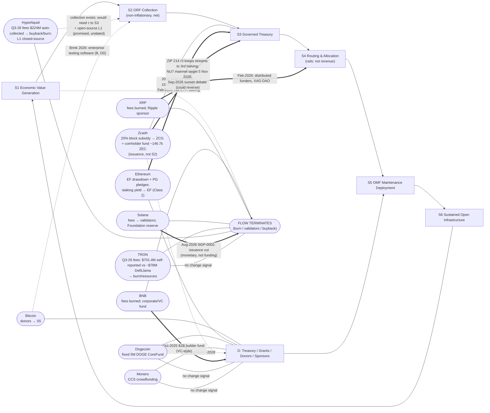

> **Changelog: Reconciled with researchy-chain-check.md, 9 Oct 2026 (~04:08 PT).** Rows applied that touch this map: TRON fees shown as $701.4M (TRON DAO, self-reported) vs ≈$77.8M (DefiLlama), **Partial**. Zcash fund restated (lockbox ~68.5k ZEC ≈ $83M + 78,750 ZEC multisig; Unverified), veto reworded as announced intent, NU7 dates added. Hyperliquid $14.58M Validated on-chain (3 Oct 2026), DefiLlama Q3 fees $224.2M, ~93% Unverified, USDH grants Partial. OpenSats live counter, PG Validated figures, Monero CCS, BNB MVB terms, Solana treasury unknown. Mermaid labels updated (still parses). **No placement changes** (§6). Full row-level detail is in `top10-chains-orf-alignment.md` §5–§6.

> **Update 9 Oct 2026 (~04:05 PT):** Christian identified the "paid open source model" circular diagram as **Intersect's POSM diagram**. It's on p.11 of the POSM whitepaper (20 Dec 2024), hosted on the Intersect Open Source Committee GitBook. The primary chain map for that diagram is now **[`posm-cycle-chain-map.md`](./posm-cycle-chain-map.md)**. This file maps the same ten chains onto the **ORF six-stage closed loop** and is **kept as a companion**. §1 below was written before the POSM diagram was located, so its "no such diagram in the repo" finding applies to the os-frontiers repo only.

# The Closed-Loop ("Paid Open Source") Cycle: Where the Top 10 Chains Sit and Where They're Heading

> **Status:** OSFL research note · **Stage 0** · no ORF Hard Gate passed · prepared 9 Oct 2026 PT · not pushed.
> Companion to `chains/top10-chains-orf-alignment.md` (rankings, sources, scores). Rankings are from the CoinGecko snapshot of 9 Oct 2026 03:51 PT.

---

## 1. Which diagram is this? (location and what I searched)

**There's no diagram in the repo titled "paid open source model".** In the repo, "Paid Open Source Model (POSM)" is the name of a **Cardano/Intersect precedent**, described in prose only: `docs/precedents/CARDANO_POSM.md` ("Operational Model": a 6-step list ending in "a reinforcing loop where ecosystem growth and treasury funding sustain long-term infrastructure maintenance"), plus `GLOSSARY.md`, `VALIDATION.md`, `evaluator/cli/live_data_analyst.py`, and `evaluator/preview/index.html`. None of those draws a cycle.

**The circular diagram the brief describes is the ORF closed loop.** It appears in four places in the repo, with the same stages each time:

| # | Path | What it is |
|---|---|---|
| **Primary (cycle)** | `whitepapers/orf-v1.0.pdf`, p.10, **Figure 2 "From Depletion Cycle to Closed Loop"** | Two columns. Left, *Today, one-way funding*: Treasury/Grants → Maintenance Funding → Open Infrastructure → Economic Value Created → **FLOW TERMINATES**. Right, *ORF closed loop*: Governed Treasury → OMF Maintenance → Open Infrastructure → Economic Value Created → **ORF Replenishment** → (arrow labelled "replenishment returns") back to Governed Treasury. Caption: "The loop closes only when captured value re-enters the governed treasury as net contribution." |
| Primary (stages) | `whitepapers/orf-v1.0.pdf`, §6 "Closed-Loop Architecture", p.20, **"The Six Stages of the Loop"** table | 1 Value Generation · 2 ORF Collection · 3 Governed Treasury · 4 Routing & Allocation ("These distribute; they never collect") · 5 OMF Deployment · 6 Sustained Infrastructure ("returning the loop to Stage 1") |
| Companion (governance cadence) | `whitepapers/orf-v1.0.pdf`, p.21, **Figure 4 "The ORF Operating Cycle"** (6-node circle marked "CONTINUOUS") | 01 Cost Floor Baseline → 02 Instrument Validation → 03 Collection & Net Accounting → 04 Treasury Transfer → 05 Ratio & Gate Review → 06 Portfolio Rebalance → back to 01. "Each gate review produces the next portfolio decision." |
| Text/HTML renderings | `orf/START_HERE.md` §1 (ASCII flow) and `docs/index.html` `<ol class="loop">` ("The closed loop: From value back to infrastructure") | The same six stage names. The HTML source comment says the stage names come from the boxes in `orf/START_HERE.md`. |

**Search log (candidates checked):** `rg -i 'circular|cycle|flywheel|paid open.source|mermaid|graph (TD|LR)|flowchart'` across the repo, excluding PDFs. Also `pdftotext` on all three PDFs (dOSPO, OMF, ORF), with Figures 2 and 4 rendered and inspected. There are **no image files** (png/svg/jpg) in the repo, and **no mermaid blocks**. "Flywheel" appears only in the OMF PDF, referring to the CNCF mentorship flywheel (not a funding cycle). `pitch/` has no diagram, only the phrase "completing the second half of the loop".

Whoever coined "paid open source cycle" may mean the closed loop above, or Cardano's POSM. **Confirm with the author.** I mapped the chains onto the ORF six-stage loop plus the Figure 2 depletion path, because those stages are the ones defined in the repo.

## 2. Stages used for mapping

| Code | Stage (repo name) | What has to be true for a chain to "reach" it (my operationalization of the repo text) |
|---|---|---|
| **D** | Depletion path (Fig. 2 left) | OSS funded by treasury, grants, donors, or sponsors. Value created downstream doesn't return. "Flow terminates." |
| **S1** | Economic Value Generation | The chain generates fees, liquidity, or activity around open infrastructure. |
| **S2** | ORF Collection | A *non-inflationary* slice of that value is collected and net-accounted (issuance doesn't count). |
| **S3** | Governed Treasury | Net proceeds go into a community-mandated treasury with caps and reserve policy. |
| **S4** | Routing & Allocation | Rails and engines (Splits, Drips, Superfluid, QF, retro rounds). **Not revenue.** |
| **S5** | OMF Maintenance Deployment | Retainers, grants, bounties, and security programs reach maintainers. |
| **S6** | Sustained (open) Infrastructure | Maintained **open** infrastructure enables the next round of S1. |

**Placement rule:** each chain gets (a) a **current position**: the furthest stage its *maintenance funding* genuinely reaches through a connected path, plus where value **leaks out**; and (b) a **direction of travel**, based only on dated 2025–2026 announcements or governance actions.

## 3. Mermaid: the loop with each chain placed

**How to read it:** `---` = where the chain sits now. `==>` = a dated direction-of-travel signal. `-.->` = a possible move that depends on something nobody has announced or decided. **No chain completes the loop.** No chain has a non-inflationary S2 that feeds an S3 which funds S5.

## 4. Chain-by-chain position and direction of travel

| # | Network | Where it sits today | Where value leaks | Direction of travel (dated evidence) | Arrow |
|---|---|---|---|---|---|
| 1 | Bitcoin | **D → S5** (donor nonprofits fund maintainers directly; OpenSats/Brink act as S4/S5) | All S1 value goes to miners; nothing returns | Steady donor base. OpenSats 2025 donations $3.16M vs $7.97M allocated (27 Jan 2026); live cumulative counter $29.9M to 352 grantees (opensats.org/funds, 9 Oct 2026). Brink 2026 adds a bug bounty and "enterprise testing software" (26 May 2026), the first Family-B seed (D0) | ↺ stationary in D; faint ↗ toward S2 via B |
| 2 | Ethereum | **D (foundation drawdown) with a partial S3**: EF treasury policy + ESP (S5) + Protocol Guild vesting/splits (S4) | L1 base fee burned. L2 sequencer revenue goes to *Optimism's* collective, not L1 maintenance | **Toward an S3 endowment model:** treasury policy (4 Jun 2025), 70k ETH staking with rewards to treasury (24 Feb 2026), ESP reworked into Wishlist/RFP (29 Aug / 3 Nov 2025). PG adds "Sponsor a Core Dev" (18 Dec 2025); PG 2025: $7,231,668 from 6,202 donors, 190 members as of 5 Aug 2026 (**Validated**). ESP Q2-2026 awards fell to ~$5.50M from ~$9.86M in Q1 | ↗ toward S3/E. S2 still missing |
| 3 | BNB Chain | **S1 → leak.** Builder funding comes from D (corporate/VC) | BEP-95 burn + quarterly Auto-Burn (36th burn, Jul 2026) + validator fees | $1B Builder Fund (8 Oct 2025) with MVB SAFE equity (up to $500K = $150K for 5% + $350K uncapped SAFE; **Partial**), so moving *further* toward VC-style funding | → lateral (deeper into D, VC variant) |
| 4 | XRP Ledger | **S1 → leak.** Builder funding from D (Ripple) | XRPL fees burned | 26 Feb 2026: shift to "distributed" funders (XRPL Commons, XAO DAO, XRP Asia, VCs). That decentralizes **S4/S5 allocation**, not collection | → lateral (S4 diversification) |
| 5 | Solana | **S1 → leak.** Foundation reserve (D) funds S5. Treasury size not published (**[RC: Validated as unknown]**) | Priority fees 100% to validators (SIMD-0096, 12 Feb 2025). Base fee 50% burned | SGP-0002 / SIMD-0550 passed 28 Aug 2026 (67.001%): issuance cut. The governance machinery works but is aimed at monetary policy. "No separate funding request" | → lateral (monetary) |
| 6 | TRON | **S1 → leak** at very large scale. TBL incubator (D) | TRX burned for resources (234.5M TRX burned in Q3 2026). Q3-2026 fees: **$701.4M per TRON DAO's "network fees" (self-reported) vs ≈$77.8M per DefiLlama (burn-based)**, about 9× apart. **[RC: Partial · trondao.org Q3 report + api.llama.fi · 2026-10-09]** | No funding-model change found. Q3 governance (Proposal 107) was technical (TVM/Ethereum alignment) | ● stationary |
| 7 | Zcash | **The only chain at S3**: consensus-level stream → ZCG (S5) + Coinholder-Controlled Fund (S3, coinholder vote + key-holder veto). The input is **issuance, not S2** | Funding is dilution, and the reserve is ZEC-correlated | **Contested.** ZIP 214 Rev. 3 (Draft, 24 Sep 2026) keeps streams to the post-NU7 3rd halving. Key-holders' **announced intent to veto** the $2.67M Bootstrap/ECC retro grant (16 Mar 2026; execution not separately confirmed). Sept 2026 public debate over making this the "final" dev fund, with no on-chain proposal as of 9 Oct 2026 (Medium). NU7 testnet 6 Oct 2026, mainnet target 5 Nov 2026. Fund ≈ lockbox ~68.5k ZEC (≈$83M, accrual since NU6.1) + 78,750 ZEC already paid to a KHO multisig (ZIP 271); total ≈146.7k ZEC ≈ $178M, **Unverified** (third-party readers) **[RC: Needs update → updated · zecstats.org / openzcash.org/lockbox · 2026-10-09]** | ⇅ fork in the road: stays at S3, or falls back to D when streams end |
| 8 | Hyperliquid | **S1 → S2-shaped collection → leak** (AF auto-converts fees to HYPE, then burns it) | All collected value goes to token holders via buyback/burn. S6 not met (closed-source L1) | Adding more buyback inputs: AQAv2 USDC reserve yield, with the first payment of **14,580,774.69 USDC to the AF on 3 Oct 2026 17:00 PT confirmed on-chain** **[RC: Validated · api.hyperliquid.xyz/info · 2026-10-09]**. DefiLlama Q3-2026 fees are $224.2M; the AF's fee share (~93% wiki / ~99% press) stays **Unverified**. Ad hoc foundation remediation grants (~$10M USDH sunset, 2026; **Partial**). Open-sourcing promised "after feature completion" (undated) | → lateral (more value toward buybacks). S2→S3 needs a governance redirect |
| 9 | Dogecoin | **D → S5** (fixed CoreFund, 500k DOGE per release) | Block rewards to miners. The corporate treasury (CleanCore) doesn't fund OSS | No funding-model change found in 2025–2026 primary sources | ● stationary |
| 10 | Monero | **D → S5** (CCS escrow, General Fund) | Block rewards to miners, by community design | No change. CCS continues with quarterly full-time dev proposals (2026). jeffro256 2026Q2 (120 XMR) and selsta (79 XMR) are now fully funded **[RC: Needs update → updated · ccs.getmonero.org/work-in-progress · 2026-10-09]** | ● stationary (principled) |

## 5. What the map shows

- **Four networks (TRON, Hyperliquid, BNB, XRP) already have strong S1→collection plumbing**, but it ends in burns, buybacks, or validator income. ORF's fastest route for these chains wouldn't be new revenue. It would be a **governance-legitimated τ redirect** of a slice of existing collection into an S3 treasury (`START_HERE` principle 1: protocol-native collection needs explicit token-holder legitimacy).
- **Zcash is the only chain with a working S3**, but it's fed by issuance. If it switched to a non-inflationary input (for example, fees from Zcash Shielded Assets), it would become the first top-10 chain to complete S2→S3→S5. I found no proposal for this, so treat it as a hypothesis.
- **Ethereum is building S3 resilience (Family E)** rather than S2 collection. Its S2-like flows (Optimism, ENS) are at the L2/app layer and fund other collectives.
- **Bitcoin, Dogecoin, and Monero choose D by design.** Monero says so explicitly on the CCS page. An ORF path for these chains would have to be off-protocol (Families B and C through neutral legal entities), which matches the repo's Neutral Legal Entity design.

## 6. Placement re-check after reconciliation (9 Oct 2026)

**No chain moves.** Reconciliation changed magnitudes (TRON shown two ways, Zcash fund restated, Hyperliquid yield confirmed) but not any flow's **destination**. That's what decides placement on this map.

| Chain | Placement change? |
|---|---|
| Bitcoin, Ethereum, BNB, XRP, Solana, TRON, Hyperliquid, Dogecoin, Monero | **No** |
| Zcash | **No.** Still S3 fed by issuance. The larger fund (incl. the 78,750 ZEC multisig) reinforces the politicization risk |

*Stage 0. No Hard Gate passed. All positions are judgments based on cited public evidence. Unverified figures are marked as such in the companion file.*
