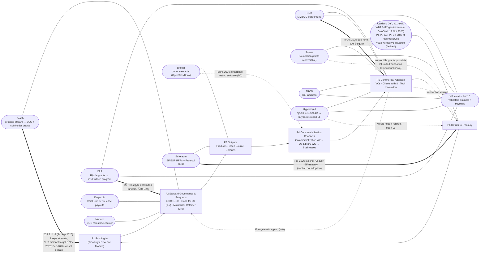

> **Changelog: Reconciled with researchy-chain-check.md, 9 Oct 2026 (~04:08 PT).** Changes:
> - **Cardano ₳5.885M** now High (on-chain): action `8ad3d454…833e#11`, enacted epoch 576 (12 Aug 2025).
> - **₳4.601M 2026-27 OSC request:** the earlier wording ("exists, status unknown") is corrected. It was **never submitted on-chain** as of epoch 660, and two dOSPO/OMF actions expired unratified.
> - **Treasury inflow:** ≈0.2% fees / ≈99.8% reserve issuance (derived by Researchy, not official). Takeaway 2 is strengthened: POSM's P6 return is mostly issuance.
> - "$300K bounty" stays Unverified (it was a planned allocation).
> - Top-10 rows updated: OpenSats Broken → fixed; PG Validated; BNB MVB Partial; TRON two-way Partial; TBL Validated; Zcash fund restated and veto reworded as intent; Hyperliquid $14.58M Validated on-chain; Monero CCS updated; Solana treasury unpublished.
> - Mermaid still parses.
> - **No placement changes for the 10 chains.** Cardano's P6 label is sharpened and its forward signal downgraded to "stalled" (§9).

# The Paid Open Source Model (POSM) Cycle: Where the Top 10 Chains Sit

> **Status:** OSFL research note · **Stage 0** · no ORF Hard Gate passed for any ecosystem, or for ORF itself · prepared 9 Oct 2026 ~04:00–04:06 PT · not pushed.
> **Companions:** `chains/top10-chains-orf-alignment.md` (rankings, evidence, 5-Question scores) · `chains/paid-oss-cycle-chain-map.md` (the same chains on the **ORF six-stage closed loop**; kept as a companion).
> **Rules:** every figure is dated and sourced. Figures I couldn't confirm on a primary page are marked **Unverified**. No invented numbers or quotes.

---

## 1. Diagram source

- **Diagram:** "Paid Open Source Model" circular diagram, © 2024 Intersect, on **p.11** of the POSM whitepaper, *Intersecting Open Source and Sustainability: A Paid Open Source Model for Ecosystems*. Prepared by Christian Taylor (Head of Open Source Office, Intersect) and Terence "Tex" McCutcheon. Dated **20 December 2024**. Contributors include Diane Mueller, Georg Link, Christian Grobmeier, Silona Bonewald, Hart Montgomery, and Patrick Sheridan.
- **Where it lives:** the Intersect **Open Source Committee GitBook** whitepaper page, which embeds the PDF: https://opensourcecommittee.docs.intersectmbo.org/about/open-source-office-oso/intersecting-open-source-and-sustainability-a-paid-open-source-model-for-ecosystems. The mirror is at `committees.docs.intersectmbo.org/...`. The PDF on GitBook and the copy in GitHub `IntersectMBO/documentation` are byte-identical (SHA-256 `44723107…73bb`).
- **Not the POSM landing-page image:** the header image on https://opensourcecommittee.docs.intersectmbo.org/about/paid-open-source-model-posm is the possum mascot and wordmark, with no cycle.
- **Local copies:** `chains/data/posm-cycle-diagram-whitepaper-p11.png` (lossless extraction) and `chains/data/Paid Open Source Model- LIVE.pdf`. Provenance is in `chains/data/POSM-SOURCES.md`. Accessed 9 Oct 2026 ~04:00 PT.
- **Text availability:** the diagram text isn't in any page HTML. I transcribed it by reading the image (2048×1150).

## 2. Transcription of the diagram

**Legend (bottom right, colour-keyed):** Workflow (Cash Flow) = green · Variables in Equation = grey · Entities doing work = blue · Current Actions = red · External Inputs = purple.

**Nodes**
- **Intersect** (drawn as a house). The roof is labelled **Open Source Office** and the left wall **Open Source Committee** (both blue). Inside, a red box holds the six SDLC stages, split into two blue groups:
  - **Code for Us Model:** 1. Ideation · 2. Productization
  - **Maintainer Retainer:** 3. Technical Validation · 4. Budgeting · 5. Implementation · 6. Measurement
  - Red labels beside the house: **Project Support Services**, **Strategic Partnerships**. Blue label: **Partners**.
- **Revenue Models** (oval, top)
- **Cardano Treasury** (oval, top right)
- **Business Alliances** (oval, far right)
- **Market Research** (oval)
- **Ecosystem Mapping** (box)
- **Commercial Adoption** (large oval), listing: 1. Venture Capitalists · 2. Clients with $ · 3. Tech Innovation
- **Products** and **Open Source Libraries** (boxes in a red frame labelled **Project Incubation** above and **Contribution Ladder** below)
- **Businesses** (oval)
- Blue labels near the bottom left: **Developer Advocates**, **Open Source Office**
- A **red dashed boundary** loops around the Intersect house, Products/Libraries, and the working-group arrows. It marks the perimeter of current actions.

**Flows (arrow direction as drawn)**
- Green (cash/workflow):
  - Revenue Models → Intersect
  - **Cardano Treasury → Intersect**
  - Intersect (after stage 6) → Products
  - Intersect → Open Source Libraries
  - Products → *(Commercialization Working Group)* → Commercial Adoption
  - Open Source Libraries → *(OS Library Working Group)* → Businesses
  - Businesses → Commercial Adoption
  - **Commercial Adoption → Cardano Treasury** (the loop-closing edge)
- Purple (external inputs):
  - Business Alliances → Commercial Adoption
  - Market Research ↔ Commercial Adoption
  - Commercial Adoption → Ecosystem Mapping
  - Ecosystem Mapping → Intersect (enters at the Technical Validation stage)

**What the PDF text says the return edge means (p.27, "Replenishing the Ecosystem Through Adoption"):** "The POSM fosters a virtuous cycle where commercial adoption drives ecosystem growth. As businesses and developers adopt Cardano's technology, they contribute to its sustainability by: Increasing transaction volume, which replenishes the Cardano Treasury. Supporting critical libraries and projects through programs like the Maintainer Retainer Program." The same page also says that through Code for Us, "businesses fund specific features required for their use cases."

### 2.1 POSM cycle stages used for chain placement (my condensation of the drawn flows)

| Code | POSM stage | Diagram elements |
|---|---|---|
| **P1** | **Funding In** | Cardano Treasury → Intersect · Revenue Models → Intersect |
| **P2** | **Steward Governance & Programs** | Intersect house: OSO + OSC. Code for Us (Ideation, Productization). Maintainer Retainer (Technical Validation → Measurement). Project Support Services, Strategic Partnerships |
| **P3** | **Outputs** | Products · Open Source Libraries, inside Project Incubation / Contribution Ladder |
| **P4** | **Commercialization Channels** | Commercialization WG → adoption · OS Library WG → Businesses |
| **P5** | **Commercial Adoption** | VCs · Clients with $ · Tech Innovation. Inputs from Business Alliances and Market Research. Output to Ecosystem Mapping, which feeds back into P2 as *information* |
| **P6** | **Return to Treasury** | Commercial Adoption → Cardano Treasury, then back to P1 |

## 3. How POSM maps onto the ORF closed loop

| POSM | ORF six-stage loop (`orf-v1.0.pdf` §6; Fig. 2) | Overlap / difference |
|---|---|---|
| P1 Funding In (Treasury, Revenue Models) | S3 Governed Treasury → S4/S5 | **Overlap:** both draw maintenance money from a governance-controlled treasury. In POSM that's a Cardano treasury withdrawal approved by DReps and the Constitutional Committee. **Difference:** "Revenue Models" is an unspecified input in POSM. ORF splits it into five families (A–E) with net-contribution accounting. |
| P2 Steward Governance & Programs | dOSPO (who decides) + **OMF S5** (deployment) | **Strong overlap.** OSC ≈ dOSPO mandate holder (the repo already says so in `CARDANO_POSM.md`). Maintainer Retainer and Code for Us ≈ OMF Programs 1 and 2. POSM puts its programs on an SDLC lifecycle. ORF/OMF put them on a project-maturity lifecycle. |
| P3 Outputs | S6 Sustained (open) Infrastructure | Overlap. POSM also counts *Products*, ORF only infrastructure. |
| P4 Commercialization Channels | (no ORF stage) | **POSM-only.** Working groups that push libraries and products toward businesses. Closest ORF analogs are Family B (enterprise) and Family C (certification) *sales motions*, which POSM leaves unpriced. |
| P5 Commercial Adoption | S1 Economic Value Generation | Overlap. POSM lists VCs among adopters. ORF wouldn't count VC investment in ecosystem projects as replenishment. |
| **P6 Return to Treasury** | **S2 ORF Collection → S3** | **The key difference.** In POSM the return is **implicit**: adoption raises transaction volume, which "replenishes the Cardano Treasury". On Cardano that edge is real but mixed (see below), and it isn't earmarked, measured, or net-accounted for OSS. ORF requires an explicit collection layer with net-contribution reporting and a cost floor, and **excludes issuance**. |

**How Cardano's treasury is actually funded (the P6 edge):** each epoch, transaction fees plus a share of reserves (ρ, monetary expansion) form a reward pot, and **20% (τ = 0.20)** goes to the treasury. — https://docs.cardano.org/about-cardano/explore-more/monetary-policy · https://docs.cardano.org/about-cardano/explore-more/parameter-guide · https://cardano.org/governance/treasury/ ("Income from transaction fees depends only on how much the network is used"; "The reserves are finite"). So:
- The **fee portion** of τ is a genuine **Family A structural share** (non-inflationary and tied to adoption). That's what POSM's P6 arrow describes.
- The **reserve portion** of τ is **issuance**, which ORF excludes from non-inflationary coverage.
- **Fee/reserve split (derived, not official):** Researchy read on-chain parameters at epoch 660 (τ = 0.2, ρ = 0.003) and Koios epoch totals over 59 withdrawal-free epochs in epochs 588–660. Fees were ≈2.66M ADA against ≈228.7M ADA of treasury inflow, so the fee-derived share (0.2 × fees) is **≈0.23% of treasury inflow** (per-epoch range 0.13–0.41%). **≈99.8% is reserve emission (issuance).** In a typical epoch that's ~45k ADA of fees against ~3.88M ADA of treasury inflow. No official fee-vs-reserve breakdown is published; cardano.org only describes the mechanism. **[RC: Needs update → updated · https://api.koios.rest/api/v1/epoch_params?_epoch_no=660 · https://api.koios.rest/api/v1/totals · 2026-10-09]**
- **Consequence:** POSM's P6 "transaction volume replenishes the treasury" edge is, in practice, **almost entirely issuance**. Under ORF the replenishment-eligible (Family A, non-inflationary) part of P6 is a fraction of a percent of inflow.
- Cardano also has a "treasury donation" transaction for returning unused funds. **Returned unspent grants are not replenishment.** The OSC minutes of 28 May 2026 say Code Forest and Summer of Code funds "are slated to return to the treasury". — https://opensourcecommittee.docs.intersectmbo.org/osc-meeting-minutes/open-source-committee-meeting-minutes/2026-meeting-minutes/05-28-2026-meeting-minutes

**Is POSM payment-for-service or replenishment?**
- **On the outflow side, it's payment for service:** retainers (Maintainer Retainer, with a 30-day evaluation and recurring reviews), bounties (Code for Us: "payment upon feature acceptance"), and contracted services (Project Support Services). In repo terms that's **OMF deployment**, the "paid" in Paid Open Source. ORF's v1.1 text classes POSM as "Treasury-funded maintenance programs … deployment precedent, not replenishment" (Loop? = "No (deployment)"). That classification still holds.
- **On the inflow side, POSM claims a loop through P6,** but treasury withdrawals are a one-way draw at the moment of funding. The return path is generic chain revenue (τ on fees + reserves; ≈99.8% reserve issuance by Researchy's derivation), not attributable to OSS and not net-accounted. Two exceptions would count as ORF-style earned revenue if they actually produced receipts: (a) the whitepaper's example of "businesses fund specific features" through Code for Us (a Family B-shaped, client-paid bounty), and (b) the "Revenue Models" input. **I found no published receipts for either (D0).**
- **Repo rule applied:** Retro Funding, grants, and issuance-funded withdrawals are **not replenishment**. POSM's funded programs (₳-denominated treasury withdrawals) are deployment.

## 4. Mermaid: the POSM cycle with the 10 chains placed

**Legend:** `---` = current placement (the furthest POSM stage reached through a connected, evidenced path; a link to LEAK means value generated at P5 leaves without returning). `==>` = a dated direction-of-travel signal. `-.->` = a possible path that nobody has announced or decided. Mermaid syntax parses (mermaid v11). **No top-10 chain closes P6 for OSS.** Cardano is shown as the reference implementation (#11 by market cap with WBT excluded, #12 under the gas-token rule, CoinGecko 9 Oct 2026; see `top100-method.md`).

## 5. Per-chain placement and direction of travel

Evidence and links are in `top10-chains-orf-alignment.md` §3; key dates are repeated here.

| # | Network | Current POSM stage | Why | Missing edge | Direction of travel (dated) |
|---|---|---|---|---|---|
| 1 | Bitcoin | **P3** (P1 donors → P2 donor stewards → P3 libraries) | OpenSats LTS/grants ($7.97M allocated in 2025, per 27 Jan 2026 report; live cumulative counter $29.9M to 352 grantees, opensats.org/funds, 9 Oct 2026; the earlier "$32.1M / 377" was Broken and has been removed), Brink fellowships. Stewards aren't governance-mandated | No P4 commercialization. No P6 (miners take all chain revenue) | Brink's 2026 plan (26 May 2026) to experiment with "enterprise testing software" is a faint P4/Family B seed (D0). Otherwise stationary |
| 2 | Ethereum | **P3**, with a capital-side P6 analog | EF ESP Wishlist/RFP (reopened 3 Nov 2025) ≈ Code-for-Us-style scoped work. Protocol Guild ≈ retainer-like distributions ($12.4M distributed in 2025; $7,231,668 raised from 6,202 unique donors; 190 members as of 5 Aug 2026, all **Validated**; ">$80M commitments" stays **Unverified**). EF staking returns yield to the EF treasury | Adoption → treasury edge absent at L1 (base fee burned) | Toward capital-funded P6: treasury policy (4 Jun 2025, 15%→5% opex glide) and 70k ETH staking (24 Feb 2026). That's an endowment return, **not adoption-driven** and Class 2 correlated |
| 3 | BNB Chain | **P5 → leak** | MVB accelerator, now inside YZi Labs' EASY Residency (up to $500K = $150K for 5% via SAFE + $350K uncapped SAFE; **Partial**), which mirrors POSM's Accelerator and "Venture Capitalists" adopter | P6: fees burned (BEP-95, quarterly Auto-Burn) or to validators | Deeper into VC-style P5: $1B Builder Fund (8 Oct 2025) |
| 4 | XRP Ledger | **P5 → leak** | Ripple grants and accelerator, now the FinTech Builder Program and VC partners | P6: fees burned | 26 Feb 2026: spreading P1/P2 across XRPL Commons, XAO DAO, XRP Asia. Allocation becomes more distributed. Collection unchanged |
| 5 | Solana | **P5 → leak** | Foundation grants, including **convertible grants** for commercial projects. Foundation treasury size is **not published** (Validated as unknown) | P6: fees to validators/burn (SIMD-0096, 12 Feb 2025) | Governance aimed at issuance (SGP-0002 passed 28 Aug 2026, 67.001%). Convertible grants are the only possible P5→P1 return among the ten (amounts unknown) |
| 6 | TRON | **P5 → leak** | TRON Builders League incubator ("Up to $5,000,000", milestone-staged; **Validated**) | P6: Q3-2026 fees of **$701.4M (TRON DAO "network fees", self-reported) vs ≈$77.8M (DefiLlama, burn-based)** go to burn/resources (**Partial**) | No signal. Stationary |
| 7 | Zcash | **P2**: the closest structural analog to POSM | A protocol stream (8% ZCG + 12% coinholder fund) funds a governed steward with coinholder votes and a key-holder veto. That matches POSM's treasury → OSC pattern | P6: the treasury refills from **issuance**, not adoption | Contested: ZIP 214 Rev. 3 (24 Sep 2026, Draft) keeps streams to the 3rd halving. Key-holders' 16 Mar 2026 **announced intent to veto** the $2,673,974 Bootstrap/ECC grant (execution not separately confirmed). The Sept 2026 "final dev fund" debate (no on-chain proposal as of 9 Oct 2026). NU7 mainnet target 5 Nov 2026. Coinholder fund ≈ lockbox ~68.5k ZEC (≈$83M, accrual since NU6.1) + 78,750 ZEC paid to a KHO multisig under ZIP 271 (≈146.7k ZEC ≈ $178M total), **Unverified** |
| 8 | Hyperliquid | **P5 → leak** (fee capture bypasses P1/P2) | Very heavy commercial adoption. Fees are auto-collected but sent to buyback/burn. L1 closed-source, so P3 "Open Source Libraries" isn't met for the core | P1/P2 stewardship for OSS. P6 goes to token holders | More buyback inputs: AQAv2 USDC yield, with **14,580,774.69 USDC to the AF on 3 Oct 2026 17:00 PT, confirmed on-chain (Validated)**. DefiLlama Q3-2026 fees $224.2M. The AF fee share (~93%) stays **Unverified**. Open-sourcing promised "after feature completion" (undated) |
| 9 | Dogecoin | **P2** | The fixed 5M DOGE CoreFund pays 500k DOGE per qualifying Core release (31 Dec 2022 rules), a release-gated bounty | P1 is not recurring. No P6 | No 2025–2026 change found |
| 10 | Monero | **P2** | CCS proposal → community funding → Core escrow → milestone payout, the purest Code-for-Us-style bounty flow | No P4–P6 by design | Stationary. 2026 full-time dev proposals continue: jeffro256 2026Q2 (120 XMR) and selsta (79 XMR) are now fully funded; vtnerd's current entry is 2026 Q3, 97.06 XMR (**updated**, ccs.getmonero.org/work-in-progress, 9 Oct 2026) |
| ref | **Cardano** | **P1–P5 live; P6 mixed** | 2025 OSC/POSM treasury withdrawal of **₳5,885,000**, now **High (on-chain)**: governance action `8ad3d454f3496a35cb0d07b0fd32f687f66338b7d60e787fc0a22939e5d8833e#11` (CIP-129 `gov_action13tfag48nf94rtjcdq7c06vhkslmxxw9h6c88sl7q5g5nnewcsvlqkqx0ecg`). Submitted epoch 570 (18 Jul 2025, 08:40 PT), ratified epoch 575, **enacted epoch 576 (12 Aug 2025, 14:44 PT)**. Koios and Cardanoscan agree. — https://cardanoscan.io/govAction/gov_action13tfag48nf94rtjcdq7c06vhkslmxxw9h6c88sl7q5g5nnewcsvlqkqx0ecg **[RC: Validated · 2026-10-09]**. That's ≈$2.94M at the proposal's $0.50/ADA and ≈$1.39M at today's $0.236 (*derived*) | P6 isn't earmarked or net-accounted, and ≈99.8% of treasury inflow is reserve issuance (derived) | **2026-27 OSC request: NOT SUBMITTED on-chain.** The text "₳4,601,000 … 1.5 year execution period" exists on the OSC GitBook, contingent on Intersect budget approval. But none of the 104 TreasuryWithdrawals actions on Koios up to epoch 660 (9 Oct 2026) is for ₳4.601M or names the OSC 2026-27 budget. Intersect's own 2026 withdrawals (₳25.4M + ₳1.193M) were **enacted at epoch 646 (28 Jul 2026)**, so the contingency appears met but the OSC action hasn't followed. Two related dOSPO/OMF actions **expired unratified**: "Cardano dOSPO and OMF Program" (₳12M, expired epoch 637) and the revised version (₳4.094M, `gov_action19apfhh339syqd0gkrxw6zr6pghdfspckr6vagjrpwnr0hx53lxpsq637y3t`, expired epoch 648). **[RC: Partial · https://api.koios.rest/api/v1/proposal_list?proposal_type=eq.TreasuryWithdrawals · 2026-10-09]** 28 May 2026 minutes: some program funds slated to return to treasury. 6 Aug 2026 minutes: no quorum (5 of 9) **[RC: Validated]** |

## 6. POSM vs ORF: key takeaways

1. **POSM is the deployment half and ORF is the replenishment half.** POSM's machinery (OSC/OSO governance, Maintainer Retainer, Code for Us, incubation, contribution ladder) maps closely onto dOSPO + OMF. Its loop-closing edge (P6, "transaction volume replenishes the Cardano Treasury") is **asserted, not instrumented**. There's no cost floor, no net-contribution accounting for OSS, and no separation of fee income from reserve issuance. On-chain data shows that separation matters: only ≈0.2% of treasury inflow is fee-derived and ≈99.8% is issuance (Researchy derivation, Koios, epochs 588–660). ORF is the layer that makes P6 measurable, so the repo's "No (deployment)" label for POSM still holds.
2. **Cardano's τ (20% of fees + reserve emissions) is the only protocol-level treasury cut in this comparison that includes a fee share.** It's a real Family A edge, but **tiny**: ≈0.2% of treasury inflow against ≈99.8% reserve issuance (both *derived* by Researchy from on-chain epoch totals; not an official figure). That strengthens the finding that **POSM's P6 return is mostly issuance**. Until fee volume rises by orders of magnitude or the reserve runs down, POSM is issuance-funded deployment with a thin adoption-linked edge. Among the top 10, Zcash has the closest structural analog (a protocol stream to a governed grants body) but funds it **entirely from issuance**. Chains with large fee bases (TRON, Hyperliquid, BNB, XRP) have no P1/P6 at all; their fees are burned or bought back.
3. **Most chains stop at P5.** Foundations and corporate funds (BNB/YZi, Ripple, TRON DAO, Solana Foundation) run accelerators that hand projects to VCs. POSM's own diagram lists "Venture Capitalists" as an adopter, which shows how POSM's commercialization arm (P4/P5) can drift toward investment instead of maintenance payment. ORF would only count client-paid services (Family B) or certification and membership (Family C) from that arm, and POSM has published no receipts for either (D0).

## 7. Stale or unsupported items in the repo's `docs/precedents/CARDANO_POSM.md` (submitted 2026-05-06)

| Item in repo file | Finding (9 Oct 2026) | Suggested action |
|---|---|---|
| No funding magnitude at all; the repo errata lists "5.885M ADA" as **Unverified** (not on the Intersect explainer) | CGOV dashboard lists "Withdraw ₳5,885,000 for OSC Budget Proposal - Paid Open Source Model…", 2025, **Enacted** | Upgrade from Unverified to **High (on-chain)**: action `8ad3d454…833e#11`, enacted epoch 576, 12 Aug 2025 **[RC: Validated]**. "$300K bounty fully utilized" stays **Unverified**. The only $300K found is the *planned* Bug Bounty line (₳600K ≈ $300K at $0.50/ADA) in the 2025 budget, an allocation, not utilization (https://governancespace.com/en-us/budget-discussions/152) **[RC: Unverified]** |
| "Estimated Timeline: transitioned … during 2025 and 2026. Multiple operational programs are now active" | The POSM page frames itself as tracking the "OSC Budget approved by DReps and the Constitutional Committee in **Q3 2025**". Minutes of 28 May 2026 report "6 active treasury programs", with Travel/Events closing and Code Forest + Summer of Code funds "slated to return to the treasury", plus a possible Accelerator fund return. A **2026-27 request (₳4,601,000, 1.5 yr)** exists as text but was **never submitted on-chain** as of epoch 660 (9 Oct 2026). Two dOSPO/OMF treasury actions (₳12M; revised ₳4.094M) expired unratified | Add the program wind-downs and fund returns. Add the 2026-27 request with status "not submitted on-chain as of 9 Oct 2026 (epoch 660)" and note the expired dOSPO/OMF actions |
| "Operational Model" (6 layers) and "reinforcing loop where ecosystem growth and treasury funding sustain long-term infrastructure maintenance" | The canonical POSM diagram (whitepaper p.11, 20 Dec 2024) is a **different structure**: Treasury/Revenue Models → Intersect SDLC (Code for Us 1–2; Maintainer Retainer 3–6) → Products/OSS Libraries → WGs → Businesses → Commercial Adoption → Cardano Treasury | Cite the whitepaper diagram and p.27 text directly. Label the "reinforcing loop" as POSM's **claim**, and note ORF's finding that P6 isn't net-accounted |
| "Funding / Sustainability Model … Unlike donation-based models, POSM attempts to institutionalize…" (no replenishment caveat) | The v1.1 manuscript classes POSM as deployment, not replenishment | Add one line: "Treasury withdrawals = OMF deployment; not ORF replenishment (repo rule)" |
| "Demonstrates the 30-day evaluation onboarding window, two-tier role structures (Core Client vs SDK Tooling)" | Live Maintainer Retainer page: the 30-day trial is confirmed. The two tiers are **Core Maintainer vs Community Maintainer** (a Trusted Committer minimum), not "Core Client vs SDK Tooling" | Correct the tier names. The 2025 proposal text says "over 50 repositories"; the POSM table says "25 open-source projects". Cite both, or pick one with a date |
| "Pro-Forma Maintenance Cost Baseline … Provides the empirical cost floor benchmarks" | No published POSM cost floor was found. Band amounts exist in 2026 minutes for tooling grants (Band 1 $15k–$35k; Band 2 $5k–$15k; Band 3 $2k–$5k) but they aren't a cost floor | Downgrade to "illustrative / not an empirical cost floor (Gate 1 not met)" |
| References | Missing the whitepaper PDF and the p.11 diagram | Add the GitBook PDF URL and `chains/data/POSM-SOURCES.md` provenance |
| Whitepaper detail (not in the repo file) | POSM PDF p.8 dates the XZ Utils backdoor "In 2023". The backdoor became public in March 2024 (the attacker's contributions began earlier) | Flag for the POSM author. Don't propagate it |

## 8. Unverified or unknown (do not publish as High)

- Cardano treasury inflow split: **≈0.2% fees / ≈99.8% reserve issuance**. That's **derived** by Researchy from Koios epoch totals; there's no official breakdown. Cite it as "derived".
- ₳5,885,000 POSM withdrawal: **resolved → High (on-chain)**, enacted epoch 576 (12 Aug 2025).
- OSC 2026-27 ₳4,601,000: **not submitted on-chain** as of epoch 660 (**Partial**: the text exists, there's no action). Why it hasn't followed Intersect's enacted 2026 budget is **unknown**.
- POSM "$300K bounty fully utilized": **Unverified**. Only a planned ₳600K (≈$300K) allocation was found.
- POSM "Revenue Models" input and client-funded Code for Us bounties: **no receipts found (D0)**.
- All top-10 chain figures carry the flags in `top10-chains-orf-alignment.md` §5.

## 9. Placement re-check after reconciliation (9 Oct 2026)

| Chain | POSM placement change? | Note |
|---|---|---|
| Bitcoin, Ethereum, BNB, XRP, Solana, TRON, Zcash, Hyperliquid, Dogecoin, Monero | **No** | Magnitudes and statuses changed; flow destinations didn't |
| Cardano (ref.) | **No stage change** (P1–P5 live). P6 relabeled from "mixed" to "≈99.8% reserve issuance (derived)" | The 2025 withdrawal is now on-chain High. The 2026-27 OSC request was never submitted, so there's **no confirmed POSM funding beyond the 2025 tranche**. That's a weaker forward signal than before (direction: stalled, not advancing) |

*Stage 0. No Hard Gate passed. The POSM diagram is © 2024 Intersect. The local copy is kept for research citation only.*
